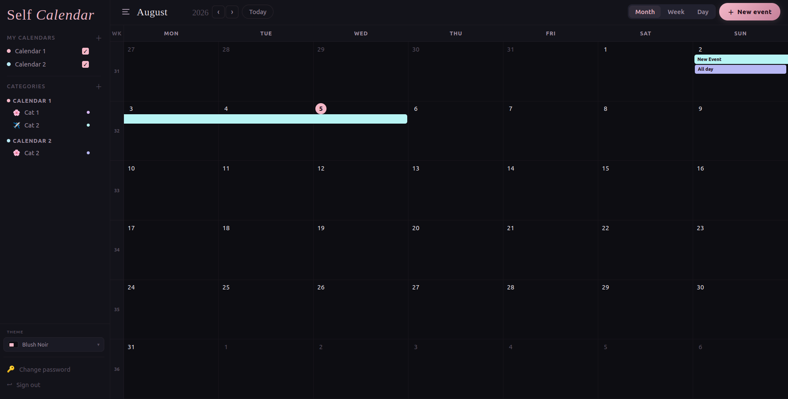
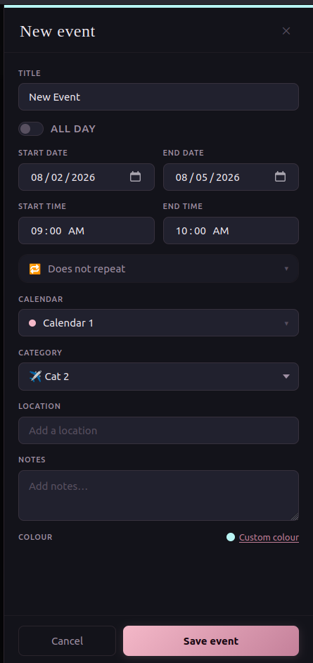
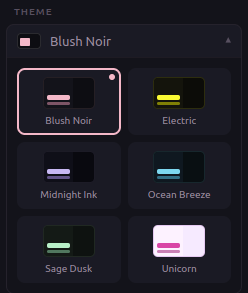
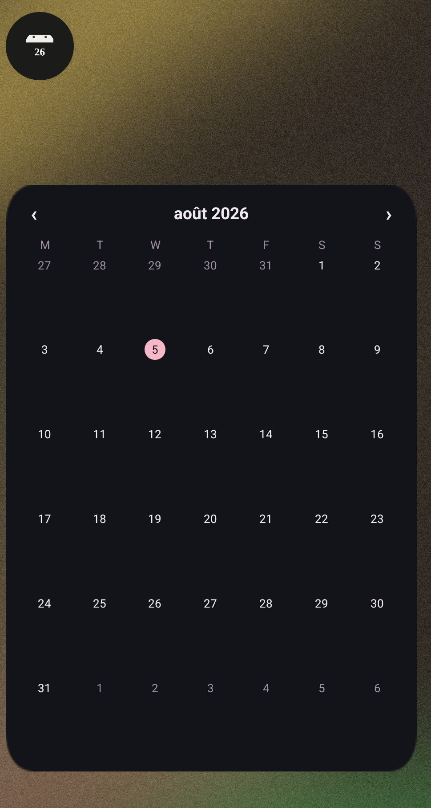

# Self Calendar

[](https://github.com/linklinsse/Self-Calendar/actions/workflows/ci.yml)

A self-hosted personal calendar: a **FastAPI + SQLModel** REST API and a **Svelte 5 / SvelteKit** frontend (also packaged as an Android/iOS app via Capacitor). Calendars can be shared between users with role-based permissions (Read / Write / Owner), and support one-off and recurring events with per-occurrence exceptions.

| Month view | Event editor |
|---|---|
|  |  |

| Themes | Android widget |
|---|---|
|  |  |

---

This file is the entry point. For implementation detail, see the sub-project docs:

- **[`api/README.md`](api/README.md)** — FastAPI backend: routes, permission model, configuration, dev commands.
- **[`app/README.md`](app/README.md)** — SvelteKit frontend: component/store layout, themes, mobile build, env vars.
- **[`docs/android-production-build.md`](docs/android-production-build.md)** — producing a signed release APK or AAB by hand.
- **[`AI-DISCLOSURE.md`](AI-DISCLOSURE.md)** — this project was started by hand and finished with substantial help from Claude. Roughly 20% hand-written, 80% AI-generated or AI-assisted by line count; the file explains how that was measured and what it doesn't capture.
- **[`LICENSE`](LICENSE)** — MIT. Do what you like with it; there is no warranty of any kind.

---

## Repository layout

```
Self-Calendar/
├── api/            FastAPI backend (Python 3.12, uv, SQLModel, SQLite)
├── app/            SvelteKit frontend (Svelte 5, Vite, Capacitor for Android/iOS)
├── ci/             GitHub Actions workflows (CI + release) — see ci/README.md, NOT installed yet
├── VERSION         Single source of truth for the release version
├── docs/           Release, Android build and go-public procedures
├── AI-DISCLOSURE.md How much of this was written with AI, and which parts
├── LICENSE         MIT
└── docker-compose.yml   Builds + runs app (nginx, :8686) + api (:8082) together
```

The two sub-projects are independent codebases (separate `package.json` / `pyproject.toml`, separate Makefiles) that only communicate over HTTP — the app talks to the api via `API_BASE_URL`.

---

## Tests

```bash
cd api && uv run pytest              # API: routes, permissions, importer parsing
cd app && npm test                   # App: recurrence expansion (vitest)
```

The API suite needs no `conf/.env` — `api/tests/conftest.py` points `DB_URL` at a temp file and sets a `SECRET_KEY` before the app is imported. The importer tests skip themselves unless the optional extra is installed (`uv sync --extra google-import`).

**CI is written but not switched on.** `ci/github-workflow-ci.yml` runs both suites plus the app build on every push; it lives outside `.github/workflows/` only because the token that opened the pull request introducing it lacked the `workflow` scope. See [`ci/README.md`](ci/README.md) for the one command that installs it.

---

## Quick start (local dev, no Docker)

```bash
# Terminal 1 — API on http://localhost:8000
cd api
make init
make dev

# Terminal 2 — App on http://localhost:5173
cd app
npm install
npm run dev
```

The app needs a running API to do anything useful (there is no mock/offline mode). By default it calls the browser's own origin; for local dev, point it at the API on its own port by creating `app/.env.local`:

```env
VITE_API_BASE_URL=http://localhost:8000
```

## Quick start (Docker / prod-style)

```bash
docker compose up -d --build
```

That's it — `docker-compose.yml` builds both images from `api/Dockerfile` and `app/Dockerfile` itself, no separate build step needed. It brings up `SelfCalendar-web` (nginx-served static build, `http://localhost:8686`) and `SelfCalendar-api` (`http://localhost:8787`, called directly by the browser — the web container does not proxy it).

**`conf/.env` must exist before you run `docker compose up`** — if it's missing (fresh clone, a `git clean`, accidentally deleted — it's gitignored so it's easy to lose), the api silently falls back to its built-in defaults, including a `DB_URL` that points *outside* the `./db` volume and into the container's own throwaway filesystem — every container recreation then looks like the database has been wiped, when really it was just never being persisted in the first place. If `conf/.env` doesn't exist:

```bash
cp conf/.env.template conf/.env
# then edit conf/.env: set a real SECRET_KEY (openssl rand -hex 32),
# and make sure CORS_ORIGINS matches web's host port below.
```

**Changing the API address without rebuilding:** expand "Server" on the login
screen, enter the address, Test, Save. It is stored per-browser and overrides
`API_BASE_URL` — useful for forks, or for pointing one build at several
deployments. See `app/README.md`.

> **If the database seems to reset on every `docker compose down`/`up`**, it is
> almost certainly `DB_URL` pointing outside the mounted volume — either
> `conf/.env` is missing the line, or `api/conf/.env.template` (whose default
> targets local development, not Docker) was copied instead of the root one.
> The API now refuses to start in that state and prints the fix, rather than
> starting cleanly on a database that is about to be thrown away.

`conf/.env.template` ships with `USER_CREATION=True` so you can register your first account from the app's login screen — **set it back to `False` once you're done creating accounts.** The login screen picks that up on its own (via `GET /auth/config`) and stops offering registration. `db/prod.db` is the persisted SQLite database — back it up like any other file.

**Deploying somewhere other than `localhost` (your own domain, different ports)** — don't edit `docker-compose.yml` itself; it reads from a root `.env` file (gitignored, Compose loads it automatically):

```bash
cp .env.example .env
# then edit .env: set API_BASE_URL to your real domain, and/or
# WEB_PORT / API_PORT if you want different host ports.
```

See `.env.example` for the full list of variables. One thing that file can't do for you: if you change `WEB_PORT`, also update `CORS_ORIGINS` in `conf/.env` to match — that's a separate file read by the `api` container itself, not reachable from `docker-compose.yml`'s own variable substitution.

---

## High-level architecture

```
┌─────────────┐  JWT bearer  ┌──────────────┐  SQLModel  ┌──────────┐
│  SvelteKit  │ ───────────▶ │   FastAPI    │ ─────────▶ │  SQLite  │
│  app (SPA)  │ ◀─────────── │   api        │ ◀───────── │ dev.db / │
└─────────────┘   JSON       └──────────────┘            │ prod.db  │
                                                            └──────────┘
```

- **Auth**: username/password login → JWT bearer token, stored in `localStorage` on the client (`sc_auth_token`). `GET /auth/config` tells the client whether registration is open, so the login screen hides its Register tab on a server running `USER_CREATION=False`.
- **Permissions**: three-level (`R`/`W`/`O`) per user-per-calendar, enforced in the api service layer via `verify_user_right_calendar`. Each calendar response also carries the caller's own `user_right`, so the app can gate owner-only UI (settings, edit/delete) without a second request.
- **Events**: one-off or recurring (daily/weekly/monthly-style rules, modeled server-side by `ObjEventRecurenceModel` + client-side by `expandEventsForRange` in `app/src/lib/utils.js`). Individual occurrences of a recurring event can be deleted via an exception record without deleting the whole series; exceptions are matched to occurrences by calendar day. Note that recurrence expansion is implemented three times — Python, JavaScript, and a hand-maintained Kotlin port for the Android widget — and has drifted before, so changes to any of them should be checked against the others.
- **Categories**: server-backed CRUD (`/category`), used to color/group events per calendar.
- **Themes**: pure client-side, no server dependency — see `app/README.md`.

For anything more specific — route lists, permission tables, store/component layout — go to the sub-project READMEs; this file intentionally stays high-level so it doesn't drift as fast as the code underneath it.

---

## Releases

`VERSION` at the repository root is the source of truth. Bump it (along with
`app/package.json` and `api/pyproject.toml`, which the workflow checks agree)
and push to `main` to cut a release containing both Docker images as
loadable tars and the Android APK. See [`ci/README.md`](ci/README.md).

The release workflow is written but **not installed yet** — it needs moving
into `.github/workflows/`, which requires a token with the `workflow` scope.

---

## Built with AI

This project was started by hand in February 2026 and finished with
substantial help from Claude (Anthropic). Roughly **20% of the current code
is hand-written and 80% is AI-generated or AI-assisted**, by surviving line
count.

Every design decision, every task, and every acceptance was human — but a
person reading this repository will find that most of what they read was
drafted by a model, and that is worth knowing up front. [`AI-DISCLOSURE.md`](AI-DISCLOSURE.md)
explains how the figure was measured, which parts came from where, and what
it cost (including code that has never run on real hardware).

---

## License

[MIT](LICENSE). Use it, change it, host it, ship it, sell it — the only
condition is that the copyright notice and license text travel with it.

It is provided **as is, with no warranty and no guarantee that it works**.
This is a self-hosted calendar holding your own data: back it up before
relying on it for anything you would be upset to lose.
